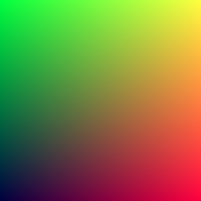
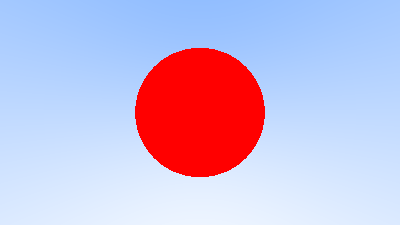

# rust-ray-tracing

これ: https://raytracing.github.io/books/RayTracingInOneWeekend.html

## Output image

## Background image

## Put One Red Sphere

## Sphere colored according to its normal vectors

