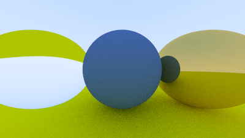

# rust-ray-tracing

これ: https://raytracing.github.io/books/RayTracingInOneWeekend.html

## Output image

## Background image

## Put One Red Sphere

## Sphere colored according to its normal vectors

BUG

## Antialiasing by sampling

## Diffuse

## Diffuse cut near the camera

## Lambertian spheres

## Metal (impl Material)

## Metal material fuzziness

## Glass sphere that sometimes refracts

## Glass with Schlick Approximation

